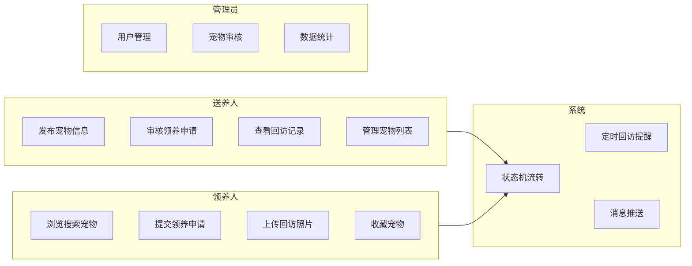
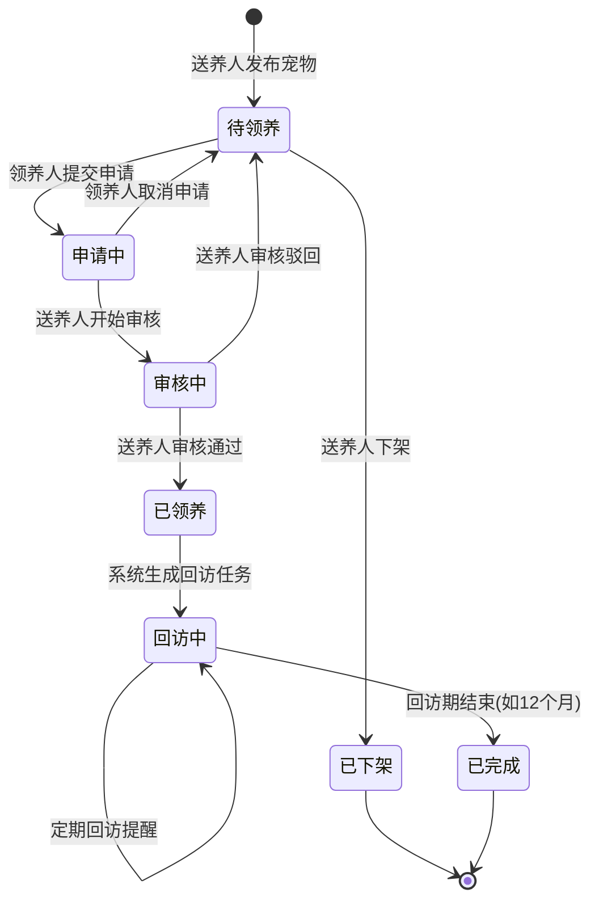
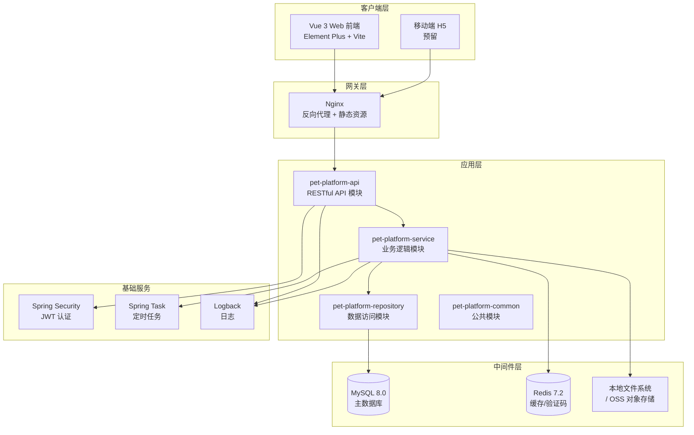
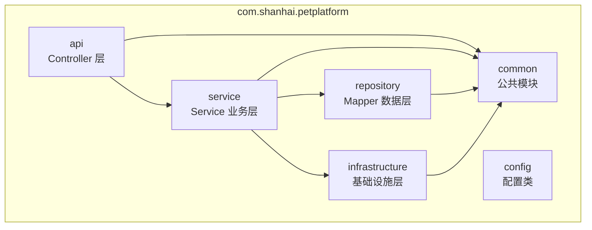
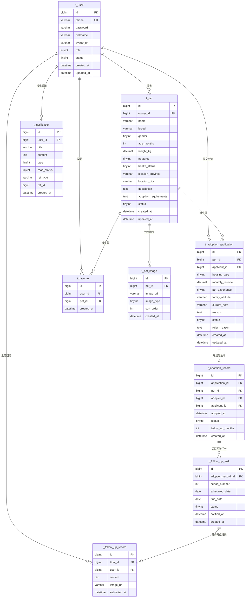
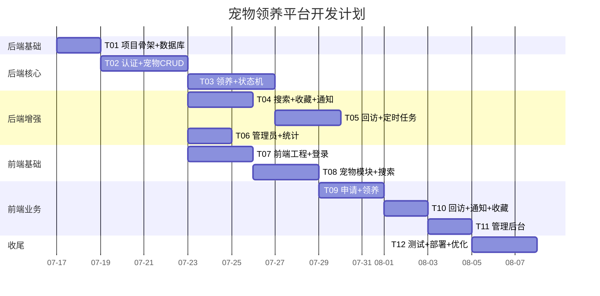

# 宠物领养信息平台 — 系统架构设计文档

> **版本**: v1.0  
> **架构师**: Bob  
> **日期**: 2025-07-14  
> **基础技术栈**: Java 17 + Spring Boot 3.2.x + MySQL 8.0.x + Vue 3  

---

## 目录

1. [需求分析](#1-需求分析)
2. [技术选型](#2-技术选型)
3. [系统架构设计](#3-系统架构设计)
4. [微服务拆分](#4-微服务拆分)
5. [数据库设计](#5-数据库设计)
6. [API 设计](#6-api-设计)
7. [前端页面规划](#7-前端页面规划)
8. [项目目录结构](#8-项目目录结构)
9. [本地开发部署方案](#9-本地开发部署方案)
10. [后续开发任务拆分](#10-后续开发任务拆分)

---

## 1. 需求分析

### 1.1 功能需求

| 模块 | 功能点 | 优先级 |
|------|--------|--------|
| **用户模块** | 注册/登录（手机号+验证码、账号密码）、JWT 鉴权、角色区分（送养人/领养人/管理员） | P0 |
| **宠物信息管理** | 发布宠物（品种、年龄、性别、健康状况、绝育情况、所在地、照片、领养要求）、编辑/下架/删除宠物 | P0 |
| **领养申请** | 领养人浏览搜索宠物 → 提交申请（住房情况、收入水平、养宠经验、家庭成员态度等） | P0 |
| **申请审核** | 送养人查看申请列表 → 审核通过/驳回（附原因）→ 状态流转 | P0 |
| **领养状态机** | 待领养 → 申请中 → 审核中 → 已领养 → 回访中 → 已完成（含驳回回退） | P0 |
| **图片存储** | 宠物照片上传/查看、领养后回访照片上传，支持本地存储或 OSS | P0 |
| **搜索筛选** | 品种、年龄范围、性别、地区、是否绝育、健康状态组合条件搜索 | P1 |
| **回访管理** | 系统自动生成回访任务、定时提醒领养人上传近况照片、送养人查看回访记录 | P1 |
| **消息通知** | 申请状态变更通知、回访提醒通知（站内信 + 可选短信/邮件） | P1 |
| **收藏功能** | 领养人收藏感兴趣的宠物 | P2 |
| **管理员功能** | 用户管理、宠物信息审核、平台数据统计 | P2 |

### 1.2 非功能需求

| 类别 | 要求 |
|------|------|
| **性能** | 搜索接口响应时间 < 500ms（P95），图片加载 < 2s |
| **可用性** | 核心服务可用性 ≥ 99.5% |
| **安全** | JWT 鉴权 + 密码 BCrypt 加密 + XSS/SQL 注入防护 + 文件上传校验 |
| **可扩展性** | 数据库支持分库分表预留、图片存储支持切换 OSS |
| **可维护性** | 模块化设计、代码注释率 ≥ 30%、Swagger API 文档 |

### 1.3 用户角色

| 角色 | 权限概述 |
|------|----------|
| **送养人 (Adopter)** | 发布宠物信息、管理自己的宠物、审核领养申请、查看回访记录 |
| **领养人 (Applicant)** | 浏览搜索宠物、提交领养申请、查看申请状态、上传回访照片、收藏宠物 |
| **管理员 (Admin)** | 用户管理、宠物信息审核、平台运营数据查看、系统配置 |

### 1.4 核心用例图



### 1.5 领养状态机



**状态转换条件详解**:

| 源状态 | 目标状态 | 触发条件 | 执行动作 |
|--------|----------|----------|----------|
| — | 待领养 | 送养人发布宠物信息 | 创建宠物记录，状态=AVAILABLE |
| 待领养 | 申请中 | 领养人提交领养申请 | 创建申请记录，宠物状态=APPLIED |
| 待领养 | 已下架 | 送养人主动下架 | 宠物状态=OFFLINE |
| 申请中 | 审核中 | 送养人查看并开始审核 | 申请状态=REVIEWING |
| 申请中 | 待领养 | 领养人取消申请 | 申请状态=CANCELLED，宠物恢复AVAILABLE |
| 审核中 | 已领养 | 送养人审核通过 | 创建领养记录，宠物状态=ADOPTED，生成回访计划 |
| 审核中 | 待领养 | 送养人驳回申请 | 申请状态=REJECTED，宠物恢复AVAILABLE |
| 已领养 | 回访中 | 系统到达首次回访时间 | 创建回访任务，宠物状态=FOLLOW_UP |
| 回访中 | 回访中 | 每次回访任务完成 | 更新回访记录，创建下次回访任务 |
| 回访中 | 已完成 | 所有回访期结束 | 宠物状态=COMPLETED，领养记录归档 |

---

## 2. 技术选型

### 2.1 技术栈总览

| 层次 | 技术 | 版本 | 说明 |
|------|------|------|------|
| **后端框架** | Spring Boot | 3.2.5 | 主框架，提供自动配置、起步依赖 |
| **JDK** | Java | 17 LTS | 长期支持版本，虚拟线程预览 |
| **Web 层** | Spring MVC (Spring Boot Starter Web) | — | RESTful API |
| **ORM** | MyBatis-Plus | 3.5.6 | 增强 MyBatis，简化 CRUD |
| **数据库** | MySQL | 8.0.36 | 关系型数据库 |
| **连接池** | HikariCP | — | Spring Boot 默认高性能连接池 |
| **缓存** | Redis | 7.2.x | 热点数据缓存、验证码存储 |
| **认证鉴权** | Spring Security + JWT (jjwt) | 0.12.5 | 无状态认证 |
| **API 文档** | SpringDoc OpenAPI (Swagger 3) | 2.5.0 | 自动生成 API 文档 |
| **参数校验** | Jakarta Validation + Hibernate Validator | — | DTO 参数校验 |
| **对象映射** | MapStruct | 1.5.5 | 编译期生成映射代码 |
| **文件存储** | 本地存储 + 预留 OSS 接口 | — | 小规模本地、大规模切换阿里云/腾讯云 OSS |
| **定时任务** | Spring Task + ShedLock | 5.2.0 | 分布式定时任务锁 |
| **状态机** | Spring Statemachine / 自实现 | — | 领养流程状态管理 |
| **日志** | Logback + SLF4J | — | Spring Boot 默认 |
| **测试** | JUnit 5 + Mockito | — | 单元测试与集成测试 |
| **前端框架** | Vue 3 | 3.4.x | Composition API |
| **前端 UI 库** | Element Plus | 2.7.x | 企业级 Vue 3 组件库 |
| **前端构建** | Vite | 5.2.x | 快速开发构建 |
| **前端状态** | Pinia | 2.1.x | Vue 3 官方状态管理 |
| **前端路由** | Vue Router | 4.3.x | SPA 路由 |
| **前端 HTTP** | Axios | 1.7.x | HTTP 客户端 |

### 2.2 选型理由

- **MyBatis-Plus**：相比 JPA，对复杂 SQL（组合搜索）更友好，且团队上手成本低
- **Redis**：验证码有效期控制、热门宠物列表缓存、分布式锁
- **ShedLock**：轻量级分布式调度锁，无需引入 XXL-JOB 等重型调度中心
- **自实现状态机**：Spring Statemachine 过于重量级，本项目状态有限，枚举+事件驱动即可
- **Vue 3 + Element Plus**：生态成熟、社区活跃，中后台场景最佳适配
- **本地存储 + OSS 接口预留**：初期量小无需 OSS 开销，通过策略模式可平滑切换

---

## 3. 系统架构设计

### 3.1 整体架构图



### 3.2 分层架构说明

```
┌─────────────────────────────────────────────────────┐
│  Controller 层 (api)                                 │
│  - 接收 HTTP 请求，参数校验，调用 Service，返回响应     │
│  - @RestController + @Validated                     │
├─────────────────────────────────────────────────────┤
│  Service 层 (service)                                │
│  - 业务逻辑编排，事务管理，状态机驱动                  │
│  - @Service + @Transactional                        │
├─────────────────────────────────────────────────────┤
│  Repository 层 (repository / mapper)                 │
│  - MyBatis-Plus Mapper 接口，数据库 CRUD             │
│  - @Mapper + BaseMapper                             │
├─────────────────────────────────────────────────────┤
│  Infrastructure 层 (infrastructure)                  │
│  - 文件存储、短信/邮件、定时任务、缓存                  │
├─────────────────────────────────────────────────────┤
│  Common 层 (common)                                  │
│  - 通用工具类、枚举、异常定义、DTO、常量                │
└─────────────────────────────────────────────────────┘
```

### 3.3 核心包图



---

## 4. 微服务拆分

### 4.1 当前阶段：模块化单体（Modular Monolith）

对于宠物领养平台初期规模（预计日活 < 10 万），**不建议过早拆分为微服务**。采用 Maven 多模块方式组织代码，保持清晰的模块边界，未来可按需拆分。

### 4.2 Maven 模块划分

| 模块 | 职责 | 依赖 |
|------|------|------|
| `pet-platform-common` | 公共枚举、常量、异常、工具类、DTO/VO 定义 | 无 |
| `pet-platform-repository` | MyBatis-Plus Mapper、Entity 实体、数据库访问 | common |
| `pet-platform-service` | 核心业务逻辑、状态机、事务编排 | common, repository |
| `pet-platform-infrastructure` | 文件存储、缓存、定时任务、消息通知 | common |
| `pet-platform-api` | RESTful Controller、Spring Security 配置、全局异常处理 | common, service, infrastructure |

### 4.3 未来微服务拆分预案（仅供参考）

当业务规模增长至需要独立部署时：

| 微服务 | 职责 | 触发条件 |
|--------|------|----------|
| `user-service` | 用户注册登录、认证鉴权、用户信息管理 | 用户量 > 100 万 |
| `pet-service` | 宠物信息 CRUD、搜索索引维护 | 宠物数据量 > 50 万 |
| `adoption-service` | 领养申请、状态机、审核流程 | 申请量 > 10 万/天 |
| `followup-service` | 回访任务调度、照片管理 | 回访量 > 5 万/天 |
| `notification-service` | 消息推送（站内信/短信/邮件） | 推送量 > 50 万/天 |
| `gateway-service` | API 网关、限流、路由 | 微服务数量 > 3 |

---

## 5. 数据库设计

### 5.1 ER 图



### 5.2 详细表结构

#### 5.2.1 t_user — 用户表

| 字段名 | 类型 | 长度 | 允许空 | 默认值 | 索引 | 注释 |
|--------|------|------|--------|--------|------|------|
| id | BIGINT | — | N | — | PK, AUTO_INCREMENT | 用户ID |
| phone | VARCHAR | 20 | N | — | UK | 手机号 |
| password | VARCHAR | 128 | N | — | — | 密码(BCrypt) |
| nickname | VARCHAR | 50 | N | — | — | 昵称 |
| avatar_url | VARCHAR | 255 | Y | NULL | — | 头像URL |
| real_name | VARCHAR | 50 | Y | NULL | — | 真实姓名 |
| id_card | VARCHAR | 18 | Y | NULL | — | 身份证号(加密) |
| email | VARCHAR | 100 | Y | NULL | — | 邮箱 |
| role | TINYINT | — | N | 1 | — | 角色: 1-领养人 2-送养人 3-管理员 |
| status | TINYINT | — | N | 1 | IDX | 状态: 1-正常 0-禁用 |
| created_at | DATETIME | — | N | CURRENT_TIMESTAMP | — | 创建时间 |
| updated_at | DATETIME | — | N | CURRENT_TIMESTAMP | — | 更新时间 |

#### 5.2.2 t_pet — 宠物信息表

| 字段名 | 类型 | 长度 | 允许空 | 默认值 | 索引 | 注释 |
|--------|------|------|--------|--------|------|------|
| id | BIGINT | — | N | — | PK | 宠物ID |
| owner_id | BIGINT | — | N | — | IDX, FK→t_user.id | 送养人ID |
| name | VARCHAR | 50 | N | — | — | 宠物名称 |
| breed | VARCHAR | 50 | N | — | IDX | 品种 |
| gender | TINYINT | — | N | — | — | 性别: 1-公 2-母 0-未知 |
| age_months | INT | — | Y | NULL | IDX | 月龄 |
| weight_kg | DECIMAL | 5,2 | Y | NULL | — | 体重(kg) |
| neutered | TINYINT | — | N | 0 | IDX | 是否绝育: 0-否 1-是 |
| health_status | TINYINT | — | N | 1 | — | 健康状态: 1-健康 2-轻微疾病 3-治疗中 4-残疾 |
| location_province | VARCHAR | 20 | Y | NULL | IDX | 所在省 |
| location_city | VARCHAR | 20 | Y | NULL | IDX | 所在市 |
| description | TEXT | — | Y | NULL | — | 详细描述 |
| adoption_requirements | TEXT | — | Y | NULL | — | 领养要求 |
| status | TINYINT | — | N | 0 | IDX | 状态: 0-待领养 1-申请中 2-审核中 3-已领养 4-回访中 5-已完成 6-已下架 |
| view_count | INT | — | N | 0 | — | 浏览次数 |
| created_at | DATETIME | — | N | CURRENT_TIMESTAMP | — | 创建时间 |
| updated_at | DATETIME | — | N | CURRENT_TIMESTAMP | — | 更新时间 |

**联合索引**: `IDX_breed_age (breed, age_months)`, `IDX_location (location_province, location_city)`, `IDX_status_neutered (status, neutered)`

#### 5.2.3 t_pet_image — 宠物图片表

| 字段名 | 类型 | 长度 | 允许空 | 默认值 | 索引 | 注释 |
|--------|------|------|--------|--------|------|------|
| id | BIGINT | — | N | — | PK | 图片ID |
| pet_id | BIGINT | — | N | — | IDX, FK→t_pet.id | 宠物ID |
| image_url | VARCHAR | 500 | N | — | — | 图片URL/路径 |
| image_type | TINYINT | — | N | 1 | — | 类型: 1-宠物照片 2-回访照片 |
| sort_order | INT | — | N | 0 | — | 排序 |
| created_at | DATETIME | — | N | CURRENT_TIMESTAMP | — | 创建时间 |

#### 5.2.4 t_adoption_application — 领养申请表

| 字段名 | 类型 | 长度 | 允许空 | 默认值 | 索引 | 注释 |
|--------|------|------|--------|--------|------|------|
| id | BIGINT | — | N | — | PK | 申请ID |
| pet_id | BIGINT | — | N | — | IDX, FK→t_pet.id | 宠物ID |
| applicant_id | BIGINT | — | N | — | IDX, FK→t_user.id | 申请人ID |
| housing_type | TINYINT | — | N | — | — | 住房类型: 1-自有房 2-租房 3-与家人同住 |
| monthly_income | DECIMAL | 10,2 | Y | NULL | — | 月收入 |
| pet_experience | TINYINT | — | N | — | — | 养宠经验: 0-无 1-有过 2-正在养 |
| family_attitude | VARCHAR | 100 | N | — | — | 家人态度 |
| current_pets | VARCHAR | 200 | Y | NULL | — | 现有宠物情况 |
| reason | TEXT | — | Y | NULL | — | 申请理由 |
| status | TINYINT | — | N | 0 | IDX | 状态: 0-待审核 1-审核中 2-已通过 3-已驳回 4-已取消 |
| reject_reason | TEXT | — | Y | NULL | — | 驳回原因 |
| created_at | DATETIME | — | N | CURRENT_TIMESTAMP | — | 创建时间 |
| updated_at | DATETIME | — | N | CURRENT_TIMESTAMP | — | 更新时间 |

**唯一索引**: `UK_pet_applicant (pet_id, applicant_id)` — 同一人对同一宠物只能申请一次

#### 5.2.5 t_adoption_record — 领养记录表

| 字段名 | 类型 | 长度 | 允许空 | 默认值 | 索引 | 注释 |
|--------|------|------|--------|--------|------|------|
| id | BIGINT | — | N | — | PK | 记录ID |
| application_id | BIGINT | — | N | — | UK, FK→t_adoption_application.id | 申请ID |
| pet_id | BIGINT | — | N | — | FK→t_pet.id | 宠物ID |
| adopter_id | BIGINT | — | N | — | FK→t_user.id | 送养人ID |
| applicant_id | BIGINT | — | N | — | FK→t_user.id | 领养人ID |
| adopted_at | DATETIME | — | N | — | — | 领养日期 |
| status | TINYINT | — | N | 0 | — | 状态: 0-领养中 1-回访中 2-已完成 |
| follow_up_months | INT | — | N | 12 | — | 回访总月数 |
| created_at | DATETIME | — | N | CURRENT_TIMESTAMP | — | 创建时间 |

#### 5.2.6 t_follow_up_task — 回访任务表

| 字段名 | 类型 | 长度 | 允许空 | 默认值 | 索引 | 注释 |
|--------|------|------|--------|--------|------|------|
| id | BIGINT | — | N | — | PK | 任务ID |
| adoption_record_id | BIGINT | — | N | — | IDX, FK→t_adoption_record.id | 领养记录ID |
| period_number | INT | — | N | — | — | 第几次回访(1/2/3...) |
| scheduled_date | DATE | — | N | — | — | 计划回访日期 |
| due_date | DATE | — | N | — | — | 截止日期 |
| status | TINYINT | — | N | 0 | IDX | 状态: 0-待执行 1-已提醒 2-已完成 3-已逾期 |
| notified_at | DATETIME | — | Y | NULL | — | 提醒通知时间 |
| created_at | DATETIME | — | N | CURRENT_TIMESTAMP | — | 创建时间 |

#### 5.2.7 t_follow_up_record — 回访记录表

| 字段名 | 类型 | 长度 | 允许空 | 默认值 | 索引 | 注释 |
|--------|------|------|--------|--------|------|------|
| id | BIGINT | — | N | — | PK | 记录ID |
| task_id | BIGINT | — | N | — | UK, FK→t_follow_up_task.id | 任务ID(一对一) |
| user_id | BIGINT | — | N | — | FK→t_user.id | 上传用户ID |
| content | TEXT | — | Y | NULL | — | 文字描述 |
| image_url | VARCHAR | 500 | Y | NULL | — | 回访照片URL |
| submitted_at | DATETIME | — | N | CURRENT_TIMESTAMP | — | 提交时间 |

#### 5.2.8 t_notification — 通知表

| 字段名 | 类型 | 长度 | 允许空 | 默认值 | 索引 | 注释 |
|--------|------|------|--------|--------|------|------|
| id | BIGINT | — | N | — | PK | 通知ID |
| user_id | BIGINT | — | N | — | IDX, FK→t_user.id | 接收用户ID |
| title | VARCHAR | 100 | N | — | — | 通知标题 |
| content | TEXT | — | Y | NULL | — | 通知内容 |
| type | TINYINT | — | N | — | — | 类型: 1-申请状态 2-审核结果 3-回访提醒 4-系统通知 |
| read_status | TINYINT | — | N | 0 | — | 阅读状态: 0-未读 1-已读 |
| ref_type | VARCHAR | 30 | Y | NULL | — | 关联类型: application/pet/follow_up |
| ref_id | BIGINT | — | Y | NULL | — | 关联ID |
| created_at | DATETIME | — | N | CURRENT_TIMESTAMP | — | 创建时间 |

#### 5.2.9 t_favorite — 收藏表

| 字段名 | 类型 | 长度 | 允许空 | 默认值 | 索引 | 注释 |
|--------|------|------|--------|--------|------|------|
| id | BIGINT | — | N | — | PK | 收藏ID |
| user_id | BIGINT | — | N | — | IDX, FK→t_user.id | 用户ID |
| pet_id | BIGINT | — | N | — | IDX, FK→t_pet.id | 宠物ID |
| created_at | DATETIME | — | N | CURRENT_TIMESTAMP | — | 创建时间 |

**唯一索引**: `UK_user_pet (user_id, pet_id)`

---

## 6. API 设计

> 统一响应格式: `{ "code": 200, "message": "success", "data": {} }`  
> 统一分页格式: `{ "code": 200, "message": "success", "data": { "records": [], "total": 100, "page": 1, "size": 10 } }`  
> 基础路径: `/api/v1`

### 6.1 认证模块 — `/api/v1/auth`

| 方法 | 路径 | 描述 | 请求参数 | 响应 |
|------|------|------|----------|------|
| POST | /auth/register | 用户注册 | `{ phone, password, nickname, role }` | `{ userId, token }` |
| POST | /auth/login | 用户登录 | `{ phone, password }` | `{ userId, token, role }` |
| POST | /auth/send-code | 发送验证码 | `{ phone }` | `{ expireSeconds }` |
| POST | /auth/refresh-token | 刷新令牌 | `{ refreshToken }` | `{ token }` |

### 6.2 用户模块 — `/api/v1/users`

| 方法 | 路径 | 描述 | 请求参数 | 响应 |
|------|------|------|----------|------|
| GET | /users/me | 获取当前用户信息 | — | 用户对象 |
| PUT | /users/me | 更新个人信息 | `{ nickname, avatarUrl, email, realName }` | 用户对象 |
| PUT | /users/me/password | 修改密码 | `{ oldPassword, newPassword }` | — |
| GET | /users/{id} | 获取用户信息 | — | 用户对象(脱敏) |

### 6.3 宠物模块 — `/api/v1/pets`

| 方法 | 路径 | 描述 | 请求参数 | 响应 |
|------|------|------|----------|------|
| POST | /pets | 发布宠物信息 | `{ name, breed, gender, ageMonths, weightKg, neutered, healthStatus, locationProvince, locationCity, description, adoptionRequirements, images[] }` | 宠物对象 |
| PUT | /pets/{id} | 更新宠物信息 | 同上(部分字段) | 宠物对象 |
| DELETE | /pets/{id} | 删除宠物 | — | — |
| GET | /pets/{id} | 获取宠物详情 | — | 宠物对象(含图片) |
| GET | /pets | 分页搜索宠物 | `?breed=&ageMin=&ageMax=&gender=&neutered=&healthStatus=&province=&city=&status=0&page=1&size=10&sortBy=` | 分页结果 |
| PUT | /pets/{id}/status | 修改宠物状态 | `{ status }` | 宠物对象 |
| POST | /pets/{id}/images | 上传宠物图片 | `multipart/form-data files[]` | `[{ imageUrl }]` |
| DELETE | /pets/{id}/images/{imageId} | 删除宠物图片 | — | — |
| GET | /pets/my | 我的宠物列表 | `?status=&page=1&size=10` | 分页结果 |

### 6.4 领养申请模块 — `/api/v1/applications`

| 方法 | 路径 | 描述 | 请求参数 | 响应 |
|------|------|------|----------|------|
| POST | /applications | 提交领养申请 | `{ petId, housingType, monthlyIncome, petExperience, familyAttitude, currentPets, reason }` | 申请对象 |
| GET | /applications/{id} | 获取申请详情 | — | 申请对象 |
| GET | /applications | 我的申请列表 | `?status=&page=1&size=10` | 分页结果 |
| GET | /applications/received | 收到的申请(送养人) | `?petId=&status=&page=1&size=10` | 分页结果 |
| PUT | /applications/{id}/review | 审核申请 | `{ action: "approve"\|"reject", rejectReason? }` | 申请对象 |
| PUT | /applications/{id}/cancel | 取消申请 | — | 申请对象 |

### 6.5 领养记录模块 — `/api/v1/adoptions`

| 方法 | 路径 | 描述 | 请求参数 | 响应 |
|------|------|------|----------|------|
| GET | /adoptions/{id} | 获取领养记录详情 | — | 记录对象 |
| GET | /adoptions | 我的领养记录 | `?status=&page=1&size=10` | 分页结果 |
| GET | /adoptions/my-pets | 我送养出去的宠物 | `?status=&page=1&size=10` | 分页结果 |

### 6.6 回访模块 — `/api/v1/follow-ups`

| 方法 | 路径 | 描述 | 请求参数 | 响应 |
|------|------|------|----------|------|
| GET | /follow-ups/tasks | 我的回访任务(领养人) | `?status=&page=1&size=10` | 分页结果 |
| GET | /follow-ups/tasks/{id} | 回访任务详情 | — | 任务对象 |
| POST | /follow-ups/tasks/{id}/submit | 提交回访记录 | `{ content, images[] }` | 回访记录 |
| GET | /follow-ups/records | 宠物回访记录(送养人) | `?adoptionRecordId=&page=1&size=10` | 分页结果 |
| GET | /follow-ups/records/{id} | 回访记录详情 | — | 回访记录 |

### 6.7 通知模块 — `/api/v1/notifications`

| 方法 | 路径 | 描述 | 请求参数 | 响应 |
|------|------|------|----------|------|
| GET | /notifications | 我的通知列表 | `?readStatus=&page=1&size=10` | 分页结果 |
| PUT | /notifications/{id}/read | 标记已读 | — | — |
| PUT | /notifications/read-all | 全部标记已读 | — | — |
| GET | /notifications/unread-count | 未读数量 | — | `{ count }` |

### 6.8 收藏模块 — `/api/v1/favorites`

| 方法 | 路径 | 描述 | 请求参数 | 响应 |
|------|------|------|----------|------|
| POST | /favorites | 收藏宠物 | `{ petId }` | — |
| DELETE | /favorites/{petId} | 取消收藏 | — | — |
| GET | /favorites | 我的收藏列表 | `?page=1&size=10` | 分页结果 |
| GET | /favorites/check/{petId} | 检查是否已收藏 | — | `{ favorited: true/false }` |

### 6.9 文件上传模块 — `/api/v1/files`

| 方法 | 路径 | 描述 | 请求参数 | 响应 |
|------|------|------|----------|------|
| POST | /files/upload | 通用文件上传 | `multipart/form-data file` | `{ url }` |
| GET | /files/{filename} | 获取文件 | — | 文件流 |

### 6.10 管理员模块 — `/api/v1/admin`

| 方法 | 路径 | 描述 | 请求参数 | 响应 |
|------|------|------|----------|------|
| GET | /admin/users | 用户管理列表 | `?phone=&role=&status=&page=1&size=10` | 分页结果 |
| PUT | /admin/users/{id}/status | 启用/禁用用户 | `{ status }` | — |
| GET | /admin/pets | 宠物管理列表 | `?status=&auditStatus=&page=1&size=10` | 分页结果 |
| GET | /admin/statistics | 平台数据统计 | — | `{ totalUsers, totalPets, totalAdoptions, ... }` |

---

## 7. 前端页面规划

### 7.1 路由设计

| 路由路径 | 页面名称 | 组件 | 权限 | 说明 |
|----------|----------|------|------|------|
| `/` | 首页 | HomePage | ALL | 宠物搜索、热门宠物展示 |
| `/login` | 登录页 | LoginPage | GUEST | 手机号+密码登录 |
| `/register` | 注册页 | RegisterPage | GUEST | 选择角色注册 |
| `/pets/:id` | 宠物详情 | PetDetailPage | ALL | 图片轮播、详细信息 |
| `/pets/search` | 搜索页 | PetSearchPage | ALL | 组合条件筛选 |
| `/publish` | 发布宠物 | PublishPetPage | ADOPTER | 发布/编辑宠物信息 |
| `/applications` | 我的申请 | MyApplicationsPage | APPLICANT | 领养申请列表 |
| `/applications/received` | 收到的申请 | ReceivedApplicationsPage | ADOPTER | 审核申请 |
| `/applications/:id` | 申请详情 | ApplicationDetailPage | ALL | 查看申请详情 |
| `/adoptions` | 我的领养 | MyAdoptionsPage | ALL | 领养记录列表 |
| `/adoptions/:id` | 领养详情 | AdoptionDetailPage | ALL | 领养详情+回访记录 |
| `/follow-ups` | 回访任务 | FollowUpTasksPage | APPLICANT | 待完成回访列表 |
| `/follow-ups/:id` | 提交回访 | SubmitFollowUpPage | APPLICANT | 上传回访照片 |
| `/notifications` | 消息通知 | NotificationsPage | ALL | 通知列表 |
| `/favorites` | 我的收藏 | MyFavoritesPage | APPLICANT | 收藏宠物列表 |
| `/profile` | 个人中心 | ProfilePage | ALL | 编辑个人信息 |
| `/admin/*` | 管理后台 | AdminLayout | ADMIN | 管理后台入口 |

### 7.2 核心组件树

```
App.vue
├── AppLayout.vue
│   ├── AppHeader.vue (导航栏 + 未读通知数 + 用户头像)
│   ├── <router-view />
│   └── AppFooter.vue
├── LoginPage.vue
│   └── LoginForm.vue
├── HomePage.vue
│   ├── SearchBar.vue (品种/地区/年龄快捷搜索)
│   ├── HotPetsSection.vue (热门宠物卡片流)
│   └── PetCard.vue (宠物卡片 × N)
├── PetSearchPage.vue
│   ├── SearchFilterPanel.vue (品种/年龄/性别/绝育/健康/地区 组合筛选)
│   └── PetList.vue
│       └── PetCard.vue × N
├── PetDetailPage.vue
│   ├── PetImageCarousel.vue (图片轮播)
│   ├── PetInfoPanel.vue (基本信息卡片)
│   ├── AdoptionRequirements.vue (领养要求)
│   └── ApplyButton.vue (申请按钮 → 申请弹窗)
├── PublishPetPage.vue
│   └── PetForm.vue (表单 + ImageUpload组件)
├── ApplicationDetailPage.vue
│   ├── ApplicationInfo.vue (申请信息+申请人信息)
│   └── ReviewActions.vue (通过/驳回按钮)
├── FollowUpTasksPage.vue
│   └── FollowUpTaskCard.vue × N
├── SubmitFollowUpPage.vue
│   └── FollowUpForm.vue (文本 + 图片上传)
├── NotificationsPage.vue
│   └── NotificationItem.vue × N
├── shared/ (共享组件)
│   ├── PetCard.vue
│   ├── ImageUpload.vue
│   ├── StatusBadge.vue
│   ├── Pagination.vue
│   ├── EmptyState.vue
│   └── ConfirmDialog.vue
└── admin/ (管理后台)
    ├── AdminLayout.vue
    ├── UserManagement.vue
    ├── PetManagement.vue
    └── StatisticsDashboard.vue
```

### 7.3 前端与后端 API 对接关系

| 前端页面 | 调用的 API |
|----------|------------|
| LoginPage | POST /auth/login |
| RegisterPage | POST /auth/send-code, POST /auth/register |
| HomePage | GET /pets (热门), GET /pets (搜索) |
| PetSearchPage | GET /pets (组合条件) |
| PetDetailPage | GET /pets/{id}, GET /favorites/check/{petId} |
| PublishPetPage | POST /pets, POST /pets/{id}/images |
| MyApplicationsPage | GET /applications |
| ReceivedApplicationsPage | GET /applications/received, PUT /applications/{id}/review |
| ApplicationDetailPage | GET /applications/{id} |
| MyAdoptionsPage | GET /adoptions, GET /adoptions/my-pets |
| FollowUpTasksPage | GET /follow-ups/tasks |
| SubmitFollowUpPage | POST /follow-ups/tasks/{id}/submit |
| NotificationsPage | GET /notifications, PUT /notifications/{id}/read |
| MyFavoritesPage | GET /favorites, DELETE /favorites/{petId} |

---

## 8. 项目目录结构

### 8.1 完整 Maven 多模块目录树

```
PetPlatform/
├── pom.xml                                    # 根 POM（聚合模块）
├── pet-platform-common/                       # 公共模块
│   ├── pom.xml
│   └── src/main/java/com/shanhai/petplatform/common/
│       ├── enums/
│       │   ├── PetStatusEnum.java             # 宠物状态枚举
│       │   ├── ApplicationStatusEnum.java     # 申请状态枚举
│       │   ├── GenderEnum.java                # 性别枚举
│       │   ├── HealthStatusEnum.java          # 健康状态枚举
│       │   ├── HousingTypeEnum.java           # 住房类型枚举
│       │   ├── PetExperienceEnum.java         # 养宠经验枚举
│       │   ├── NotificationTypeEnum.java      # 通知类型枚举
│       │   ├── UserRoleEnum.java              # 用户角色枚举
│       │   └── FollowUpStatusEnum.java        # 回访状态枚举
│       ├── constant/
│       │   ├── RedisKeyConstant.java          # Redis Key 常量
│       │   └── SystemConstant.java            # 系统常量
│       ├── exception/
│       │   ├── BusinessException.java         # 业务异常
│       │   ├── UnauthorizedException.java     # 未授权异常
│       │   ├── NotFoundException.java         # 资源不存在异常
│       │   └── ForbiddenException.java        # 无权限异常
│       ├── dto/
│       │   ├── request/                       # 请求 DTO
│       │   │   ├── LoginRequest.java
│       │   │   ├── RegisterRequest.java
│       │   │   ├── PetCreateRequest.java
│       │   │   ├── PetSearchRequest.java
│       │   │   ├── ApplicationSubmitRequest.java
│       │   │   ├── ApplicationReviewRequest.java
│       │   │   └── FollowUpSubmitRequest.java
│       │   ├── response/                      # 响应 VO
│       │   │   ├── PetVO.java
│       │   │   ├── PetDetailVO.java
│       │   │   ├── ApplicationVO.java
│       │   │   ├── AdoptionRecordVO.java
│       │   │   ├── FollowUpTaskVO.java
│       │   │   ├── FollowUpRecordVO.java
│       │   │   ├── NotificationVO.java
│       │   │   └── UserVO.java
│       │   └── PageDTO.java                   # 分页请求 DTO
│       ├── result/
│       │   ├── R.java                         # 统一响应类
│       │   └── PageResult.java                # 分页响应类
│       └── util/
│           └── EnumUtils.java                 # 枚举工具类
├── pet-platform-repository/                   # 数据访问模块
│   ├── pom.xml
│   └── src/main/java/com/shanhai/petplatform/repository/
│       ├── entity/
│       │   ├── User.java
│       │   ├── Pet.java
│       │   ├── PetImage.java
│       │   ├── AdoptionApplication.java
│       │   ├── AdoptionRecord.java
│       │   ├── FollowUpTask.java
│       │   ├── FollowUpRecord.java
│       │   ├── Notification.java
│       │   └── Favorite.java
│       └── mapper/
│           ├── UserMapper.java
│           ├── PetMapper.java
│           ├── PetImageMapper.java
│           ├── AdoptionApplicationMapper.java
│           ├── AdoptionRecordMapper.java
│           ├── FollowUpTaskMapper.java
│           ├── FollowUpRecordMapper.java
│           ├── NotificationMapper.java
│           └── FavoriteMapper.java
├── pet-platform-service/                      # 业务逻辑模块
│   ├── pom.xml
│   └── src/main/java/com/shanhai/petplatform/service/
│       ├── UserService.java
│       ├── AuthService.java
│       ├── PetService.java
│       ├── AdoptionApplicationService.java
│       ├── AdoptionRecordService.java
│       ├── FollowUpService.java
│       ├── NotificationService.java
│       ├── FavoriteService.java
│       ├── FileStorageService.java
│       └── impl/
│           ├── UserServiceImpl.java
│           ├── AuthServiceImpl.java
│           ├── PetServiceImpl.java
│           ├── AdoptionApplicationServiceImpl.java
│           ├── AdoptionRecordServiceImpl.java
│           ├── FollowUpServiceImpl.java
│           ├── NotificationServiceImpl.java
│           ├── FavoriteServiceImpl.java
│           └── FileStorageServiceImpl.java
├── pet-platform-infrastructure/               # 基础设施模块
│   ├── pom.xml
│   └── src/main/java/com/shanhai/petplatform/infrastructure/
│       ├── security/
│       │   ├── JwtTokenProvider.java          # JWT 生成/校验
│       │   ├── JwtAuthenticationFilter.java   # JWT 认证过滤器
│       │   ├── SecurityConfig.java            # Spring Security 配置
│       │   ├── UserDetailsServiceImpl.java    # 用户详情服务
│       │   └── CurrentUser.java               # @CurrentUser 注解
│       ├── storage/
│       │   ├── FileStorageStrategy.java       # 存储策略接口
│       │   ├── LocalFileStorageStrategy.java  # 本地存储实现
│       │   └── OssFileStorageStrategy.java    # OSS 存储实现（预留）
│       ├── cache/
│       │   ├── RedisConfig.java               # Redis 配置
│       │   └── CacheService.java              # 缓存服务
│       ├── schedule/
│       │   ├── ScheduleConfig.java            # 定时任务配置
│       │   ├── FollowUpReminderTask.java      # 回访提醒定时任务
│       │   └── ShedLockConfig.java            # 分布式锁配置
│       └── notification/
│           └── NotificationSender.java        # 消息推送服务
├── pet-platform-api/                          # API 模块（入口）
│   ├── pom.xml
│   └── src/main/java/com/shanhai/petplatform/api/
│       ├── PetPlatformApplication.java        # Spring Boot 启动类
│       ├── controller/
│       │   ├── AuthController.java
│       │   ├── UserController.java
│       │   ├── PetController.java
│       │   ├── AdoptionApplicationController.java
│       │   ├── AdoptionRecordController.java
│       │   ├── FollowUpController.java
│       │   ├── NotificationController.java
│       │   ├── FavoriteController.java
│       │   ├── FileController.java
│       │   └── AdminController.java
│       ├── config/
│       │   ├── WebMvcConfig.java              # CORS/拦截器配置
│       │   ├── MyBatisPlusConfig.java         # MyBatis-Plus 配置
│       │   └── SwaggerConfig.java             # SpringDoc 配置
│       └── handler/
│           └── GlobalExceptionHandler.java    # 全局异常处理
├── pet-platform-api/src/main/resources/
│   ├── application.yml                        # 主配置
│   ├── application-dev.yml                    # 开发环境
│   ├── application-prod.yml                   # 生产环境
│   ├── db/migration/                          # Flyway 数据库迁移脚本
│   │   ├── V1__init_schema.sql
│   │   └── V2__seed_data.sql
│   └── logback-spring.xml                     # 日志配置
├── pet-platform-frontend/                     # 前端工程
│   ├── package.json
│   ├── vite.config.ts
│   ├── tsconfig.json
│   ├── index.html
│   └── src/
│       ├── main.ts
│       ├── App.vue
│       ├── router/
│       │   └── index.ts
│       ├── stores/
│       │   ├── user.ts                        # 用户状态
│       │   └── notification.ts                # 通知状态
│       ├── api/
│       │   ├── request.ts                     # Axios 封装+拦截器
│       │   ├── auth.ts
│       │   ├── pets.ts
│       │   ├── applications.ts
│       │   ├── adoptions.ts
│       │   ├── followUps.ts
│       │   ├── notifications.ts
│       │   ├── favorites.ts
│       │   └── files.ts
│       ├── views/
│       │   ├── HomePage.vue
│       │   ├── LoginPage.vue
│       │   ├── RegisterPage.vue
│       │   ├── PetSearchPage.vue
│       │   ├── PetDetailPage.vue
│       │   ├── PublishPetPage.vue
│       │   ├── MyApplicationsPage.vue
│       │   ├── ReceivedApplicationsPage.vue
│       │   ├── ApplicationDetailPage.vue
│       │   ├── MyAdoptionsPage.vue
│       │   ├── AdoptionDetailPage.vue
│       │   ├── FollowUpTasksPage.vue
│       │   ├── SubmitFollowUpPage.vue
│       │   ├── NotificationsPage.vue
│       │   ├── MyFavoritesPage.vue
│       │   ├── ProfilePage.vue
│       │   └── admin/
│       │       ├── AdminLayout.vue
│       │       ├── UserManagement.vue
│       │       ├── PetManagement.vue
│       │       └── StatisticsDashboard.vue
│       ├── components/
│       │   ├── shared/
│       │   │   ├── PetCard.vue
│       │   │   ├── ImageUpload.vue
│       │   │   ├── StatusBadge.vue
│       │   │   ├── Pagination.vue
│       │   │   ├── EmptyState.vue
│       │   │   └── ConfirmDialog.vue
│       │   ├── layout/
│       │   │   ├── AppLayout.vue
│       │   │   ├── AppHeader.vue
│       │   │   └── AppFooter.vue
│       │   └── pet/
│       │       ├── PetImageCarousel.vue
│       │       ├── PetInfoPanel.vue
│       │       ├── AdoptionRequirements.vue
│       │       └── ApplyButton.vue
│       ├── types/
│       │   └── index.ts                      # TypeScript 类型定义
│       ├── utils/
│       │   └── index.ts
│       └── styles/
│           └── global.scss
└── docs/
    ├── system_design.md
    ├── class-diagram.mermaid
    └── sequence-diagram.mermaid
```

---

## 9. 本地开发部署方案

### 9.1 环境依赖

| 软件 | 版本 | 用途 | 下载地址 |
|------|------|------|----------|
| JDK | 17.0.x LTS | Java 运行环境 | https://adoptium.net |
| Maven | 3.9.x | 项目构建 | https://maven.apache.org |
| MySQL | 8.0.x | 主数据库 | https://dev.mysql.com/downloads |
| Redis | 7.2.x (Windows 可用 Memurai) | 缓存/验证码 | https://redis.io/download |
| Node.js | 20.x LTS | 前端构建 | https://nodejs.org |
| pnpm | 9.x | 前端包管理 | `npm install -g pnpm` |
| IDE | IntelliJ IDEA 2024+ | 后端开发 | https://jetbrains.com/idea |

### 9.2 数据库初始化

```sql
-- 1. 创建数据库
CREATE DATABASE IF NOT EXISTS pet_platform
    DEFAULT CHARACTER SET utf8mb4
    DEFAULT COLLATE utf8mb4_unicode_ci;

-- 2. 创建用户
CREATE USER IF NOT EXISTS 'petapp'@'localhost' IDENTIFIED BY 'PetApp@2024';
GRANT ALL PRIVILEGES ON pet_platform.* TO 'petapp'@'localhost';
FLUSH PRIVILEGES;
```

### 9.3 后端配置步骤

**Step 1: 克隆项目**
```bash
git clone <repository-url>
cd PetPlatform
```

**Step 2: 配置 application-dev.yml**
```yaml
spring:
  datasource:
    url: jdbc:mysql://localhost:3306/pet_platform?useUnicode=true&characterEncoding=utf8mb4&serverTimezone=Asia/Shanghai
    username: petapp
    password: PetApp@2024
    driver-class-name: com.mysql.cj.jdbc.Driver
  data:
    redis:
      host: localhost
      port: 6379
      password: 
  servlet:
    multipart:
      max-file-size: 10MB
      max-request-size: 50MB

mybatis-plus:
  configuration:
    map-underscore-to-camel-case: true
    log-impl: org.apache.ibatis.logging.stdout.StdOutImpl
  global-config:
    db-config:
      id-type: auto
      logic-delete-field: deleted
      logic-delete-value: 1
      logic-not-delete-value: 0

app:
  jwt:
    secret: <your-256-bit-secret-key>
    expiration-ms: 86400000   # 24小时
    refresh-expiration-ms: 604800000  # 7天
  file:
    storage-type: local       # local | oss
    local-path: ./uploads
    allowed-extensions: jpg,jpeg,png,webp
  follow-up:
    default-months: 12        # 默认回访期
    interval-months: 1        # 回访间隔(月)
    reminder-days-before: 3   # 提前几天提醒

springdoc:
  api-docs:
    path: /api-docs
  swagger-ui:
    path: /swagger-ui.html
```

**Step 3: 编译启动**
```bash
# 编译
mvn clean compile -DskipTests

# 启动
mvn spring-boot:run -pl pet-platform-api

# 或使用 IDE 直接运行 PetPlatformApplication
```

**Step 4: 验证**
- API 文档: http://localhost:8080/swagger-ui.html
- 健康检查: http://localhost:8080/actuator/health

### 9.4 前端配置步骤

```bash
cd pet-platform-frontend

# 安装依赖
pnpm install

# 启动开发服务器（默认 5173 端口，后端代理到 8080）
pnpm dev

# 生产构建
pnpm build
```

**Vite 代理配置** (`vite.config.ts`):
```typescript
export default defineConfig({
  server: {
    port: 5173,
    proxy: {
      '/api': {
        target: 'http://localhost:8080',
        changeOrigin: true
      }
    }
  }
})
```

### 9.5 一键启动脚本（Docker Compose）— 可选

创建 `docker-compose.yml`:
```yaml
version: '3.8'
services:
  mysql:
    image: mysql:8.0.36
    environment:
      MYSQL_ROOT_PASSWORD: root123
      MYSQL_DATABASE: pet_platform
      MYSQL_USER: petapp
      MYSQL_PASSWORD: PetApp@2024
    ports:
      - "3306:3306"
    volumes:
      - mysql_data:/var/lib/mysql
  redis:
    image: redis:7.2-alpine
    ports:
      - "6379:6379"
volumes:
  mysql_data:
```

```bash
docker-compose up -d
```

---

## 10. 后续开发任务拆分

### 10.1 任务总览

| 阶段 | 任务编号 | 任务名称 | 预估人天 | 依赖 |
|------|----------|----------|----------|------|
| **阶段一: 基础框架** | T01 | 项目骨架搭建 + 数据库初始化 | 2d | — |
| **阶段二: 核心功能** | T02 | 用户认证 + 宠物 CRUD + 图片上传 | 4d | T01 |
| | T03 | 领养申请 + 审核 + 状态机 | 4d | T02 |
| **阶段三: 增强功能** | T04 | 搜索筛选 + 收藏 + 通知 | 3d | T02 |
| | T05 | 回访管理 + 定时任务 | 3d | T03 |
| **阶段四: 管理后台** | T06 | 管理员功能 + 数据统计 | 2d | T02 |
| **阶段五: 前端基础** | T07 | 前端工程搭建 + 登录注册 + 首页 | 3d | T02 |
| | T08 | 宠物模块 + 搜索页 | 3d | T07 |
| **阶段六: 前端业务** | T09 | 申请流程 + 领养记录页面 | 3d | T08, T03 |
| | T10 | 回访 + 通知 + 收藏 + 个人中心 | 2d | T09, T05 |
| | T11 | 管理后台页面 | 2d | T10, T06 |
| **阶段七: 收尾** | T12 | 集成测试 + 部署文档 + 性能优化 | 3d | T11 |

### 10.2 任务详细说明

#### T01: 项目骨架搭建 + 数据库初始化 (2d) 🔴 P0

**内容**:
- 创建 Maven 多模块项目结构（common / repository / service / infrastructure / api）
- 配置父 POM 依赖管理（Spring Boot 3.2.5、MyBatis-Plus 3.5.6、jjwt 0.12.5 等）
- 编写 application-dev.yml / application-prod.yml
- 配置 MyBatis-Plus、Redis、SpringDoc
- 编写 SQL 建表脚本（V1__init_schema.sql）
- 创建所有 Entity 实体类（9 个表）
- 创建所有 Mapper 接口（继承 BaseMapper）
- 创建全局异常处理 GlobalExceptionHandler
- 创建统一响应类 R.java 和 PageResult.java
- 验证项目可正常启动

**产出物**: 完整项目骨架 + 数据库表 + 实体类 + Mapper

---

#### T02: 用户认证 + 宠物 CRUD + 图片上传 (4d) 🔴 P0

**内容**:
- Spring Security + JWT 集成：JwtTokenProvider、JwtAuthenticationFilter、SecurityConfig
- 认证接口：POST /auth/register、POST /auth/login、POST /auth/send-code
- 用户接口：GET/PUT /users/me、PUT /users/me/password
- 宠物 CRUD：POST/GET/PUT/DELETE /pets、GET /pets/{id}
- MyBatis-Plus 分页插件 + 宠物分页查询
- 图片上传接口：POST /files/upload
- 本地文件存储策略实现
- 文件类型/大小校验
- 所有枚举类定义

**产出物**: 认证体系 + 宠物管理 API + 图片上传

---

#### T03: 领养申请 + 审核 + 状态机 (4d) 🔴 P0

**内容**:
- 领养申请接口：POST /applications、GET /applications、GET /applications/{id}
- 送养人审核接口：GET /applications/received、PUT /applications/{id}/review
- 取消申请接口：PUT /applications/{id}/cancel
- **核心：领养状态机实现**
  - 使用枚举 + 事件驱动模式
  - AdoptionStateMachine 类：统一状态转换入口
  - 每个转换触发对应业务动作（创建领养记录、生成回访计划等）
- 领养记录接口：GET /adoptions、GET /adoptions/{id}
- 状态变更通知（审核结果通知申请人）
- 事务管理（状态转换 + 记录创建 + 通知发送）

**产出物**: 完整领养流程 API + 状态机

---

#### T04: 搜索筛选 + 收藏 + 通知 (3d) 🟡 P1

**内容**:
- 宠物多条件动态搜索：MyBatis 动态 SQL，支持 breed/ageMin/ageMax/gender/neutered/healthStatus/province/city 组合
- 搜索结果排序：按发布时间/浏览量
- 收藏接口：POST/DELETE/GET /favorites
- 通知接口：GET /notifications、PUT /notifications/{id}/read、PUT /notifications/read-all、GET /notifications/unread-count
- 通知触发点：新申请通知送养人、审核结果通知领养人

**产出物**: 搜索 + 收藏 + 通知 API

---

#### T05: 回访管理 + 定时任务 (3d) 🟡 P1

**内容**:
- 回访计划自动生成：审核通过时根据配置创建 12 个月回访任务
- 回访任务接口：GET /follow-ups/tasks、GET /follow-ups/tasks/{id}
- 提交回访接口：POST /follow-ups/tasks/{id}/submit
- 回访记录查询：GET /follow-ups/records
- **定时任务**：FollowUpReminderTask
  - 每天凌晨扫描未来 3 天内到期的回访任务
  - 发送站内信提醒领养人
  - 标记逾期任务（超期未提交）
- ShedLock 分布式锁配置（防止多实例重复执行）

**产出物**: 回访管理 API + 定时提醒任务

---

#### T06: 管理员功能 + 数据统计 (2d) 🟢 P2

**内容**:
- 用户管理：GET /admin/users、PUT /admin/users/{id}/status
- 宠物管理：GET /admin/pets（可按状态筛选）
- 数据统计：GET /admin/statistics
  - 总用户数、总宠物数、总领养数
  - 按月份统计新增领养
  - 按品种统计热门宠物

**产出物**: 管理后台 API

---

#### T07: 前端工程搭建 + 登录注册 + 首页 (3d) 🔴 P0

**内容**:
- Vite + Vue 3 + TypeScript + Element Plus 工程搭建
- Axios 封装（请求/响应拦截器、JWT 自动附加）
- Pinia 用户状态管理
- Vue Router 路由配置（含权限守卫）
- 共享组件：AppLayout、AppHeader、AppFooter
- 登录/注册页面
- 首页：热门宠物卡片流、搜索栏入口

**产出物**: 前端基础框架 + 登录注册 + 首页

---

#### T08: 宠物模块 + 搜索页面 (3d) 🔴 P0

**内容**:
- 宠物发布/编辑表单页（含 ImageUpload 组件）
- 宠物详情页（PetImageCarousel + PetInfoPanel + ApplyButton）
- 搜索页（SearchFilterPanel 组合筛选 + PetList）
- PetCard 通用卡片组件
- StatusBadge 状态标签组件

**产出物**: 宠物模块前端页面

---

#### T09: 申请流程 + 领养记录页面 (3d) 🟡 P1

**内容**:
- 领养申请提交弹窗（ApplyButton 触发）
- 我的申请列表页
- 收到的申请列表页（送养人视角）
- 申请详情页（含 ReviewActions 通过/驳回操作）
- 领养记录列表页、详情页

**产出物**: 申请 + 领养前端页面

---

#### T10: 回访 + 通知 + 收藏 + 个人中心 (2d) 🟡 P1

**内容**:
- 回访任务列表页、提交回访页（FollowUpForm）
- 消息通知列表页
- 我的收藏页
- 个人中心/资料编辑页

**产出物**: 辅助功能前端页面

---

#### T11: 管理后台页面 (2d) 🟢 P2

**内容**:
- AdminLayout 管理后台布局
- 用户管理页
- 宠物管理页
- 数据统计仪表盘

**产出物**: 管理后台页面

---

#### T12: 集成测试 + 部署文档 + 性能优化 (3d) 🔴 P0

**内容**:
- 核心流程集成测试（注册→发布宠物→申请→审核→回访）
- API 单元测试覆盖
- 性能优化：热门宠物 Redis 缓存、数据库索引验证
- Dockerfile + docker-compose 部署配置
- Nginx 静态资源 + 反向代理配置
- 部署运维文档

**产出物**: 测试用例 + 部署配置 + 运维文档

---

### 10.3 依赖关系图



### 10.4 里程碑节点

| 里程碑 | 时间点 | 交付物 |
|--------|--------|--------|
| M1: 基础可运行 | T01 + T02完成 | 项目可启动 + 用户可注册登录 + 可发布宠物 |
| M2: 核心闭环 | T03 + T07 + T08完成 | 完整的发布→申请→审核流程前后端打通 |
| M3: 功能完整 | T04~T06 + T09~T11完成 | 所有功能可用 |
| M4: 可上线 | T12完成 | 测试通过 + 部署就绪 |

### 10.5 预估总工作量

| 类别 | 人天 |
|------|------|
| 后端开发 | 18d |
| 前端开发 | 13d |
| 测试+部署 | 3d |
| **合计** | **34d** |

建议配置：2 后端 + 1 前端，预计 **4-5 周**完成全部开发。

---

> **文档结束** — 本文档由系统架构师 Bob 编写，作为后续代码生成的完整依据。如有疑问请联系架构师确认。
